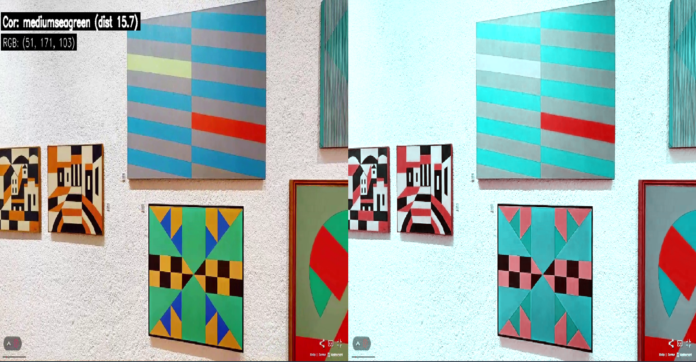
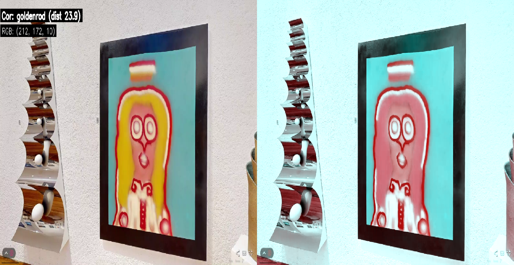

# 🎨 ColorEye - Detecção de Cores com Simulação de Daltonismo

**ColorEye** é um projeto desenvolvido para auxiliar pessoas com daltonismo a identificar cores com mais precisão em ambientes visuais, como **galerias de arte**. A ferramenta detecta cores em tempo real a partir de vídeos, simula a visão com deuteranopia (um tipo comum de daltonismo) e utiliza síntese de voz para anunciar a cor detectada. Assim, o visitante pode ter uma experiência mais rica, entendendo as cores originais de obras e ambientes.

---

## 👤 Integrantes

- Ana Eliza - RM 96277
- Lara Gonçalves - RM 95028
- Leonardo Alves - RM 93868
- Vinicius Panessa - RM 94591

---

## 🧩 Funcionalidades

- 🎯 Detecção de pontos clicados no vídeo.
- 🎨 Identificação da cor exata ou a mais próxima da tabela CSS3.
- 🧠 Cálculo da distância entre cores RGB.
- 🗣️ Anúncio da cor via voz (TTS).
- 👁️ Simulação de daltonismo (deuteranopia).
- 📺 Visualização lado a lado: vídeo original e simulado.

---

## ⚙️ Requisitos

Antes de iniciar, certifique-se de ter:

- Python 3.8 ou superior
- Pip (gerenciador de pacotes do Python)

---

## ▶️ Como executar o projeto

1. Clone ou baixe este repositório.
2. Certifique-se de que o vídeo video.mp4 esteja presente na raiz do projeto (já incluso no repositório).
3. Crie o ambiente virtual e ative-o:
```
python -m venv venv

#windows 
venv\Scripts\activate

#linux/macOS 
source venv/bin/activate
``` 
4. Instale as dependências:
```bash
pip install opencv-python
pip install numpy
pip install pyttsx3
pip install webcolors==1.11.1
```
5. Execute o script:
```bash
python daltonismo.py
```
6. Pressione Q para sair a qualquer momento.

---

## 🎥 Ilustrações



